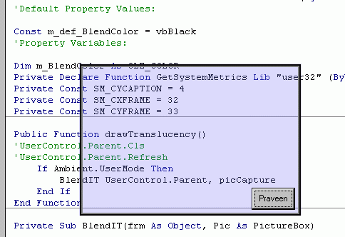



## Translucency OCX V2

### Description

Guys as i promised, here am back with the resizeable and moveable version of Translucency OCX... a Novel method to implement translucency to your VB Forms, with just a single line of code !!!!! You expect it to be more easy ????
 
### More Info
 

             |
---                |---
**Submitted On**   |2002-05-05 17:54:22
**By**             |[PraveenMenon](https://github.com/Planet-Source-Code/PSCIndex/blob/master/ByAuthor/praveenmenon.md)
**Level**          |Beginner
**User Rating**    |4.7 (66 globes from 14 users)
**Compatibility**  |VB 5\.0, VB 6\.0
**Category**       |[Custom Controls/ Forms/  Menus](https://github.com/Planet-Source-Code/PSCIndex/blob/master/ByCategory/custom-controls-forms-menus__1-4.md)
**World**          |[Visual Basic](https://github.com/Planet-Source-Code/PSCIndex/blob/master/ByWorld/visual-basic.md)
**Archive File**   |[Translucen79543552002\.zip](https://github.com/Planet-Source-Code/praveenmenon-translucency-ocx-v2__1-34472/archive/master.zip)

